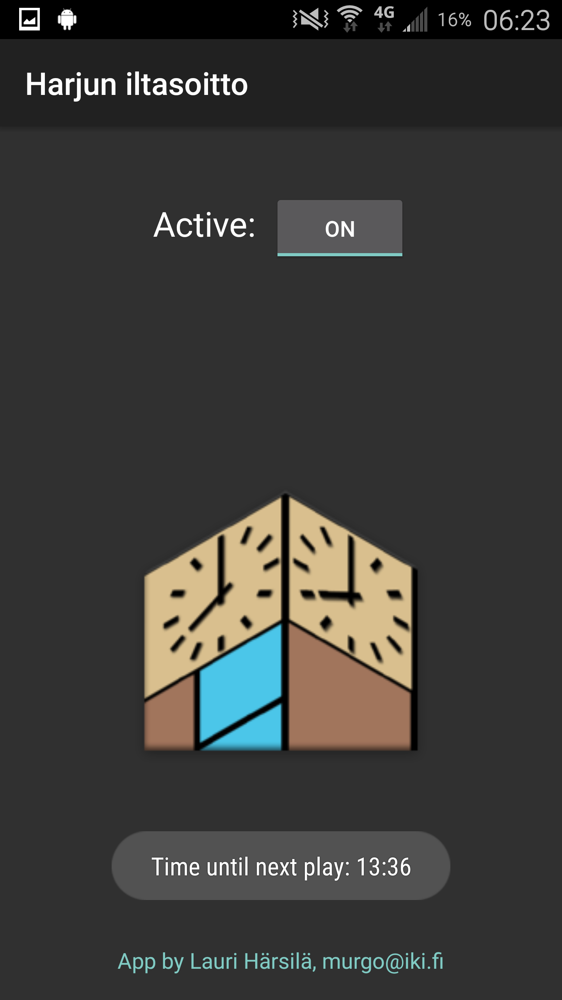

# Harjun iltasoitto
Source code for *Harjun iltasoitto*, an Android app that plays the song "Oi, päivät seutuvilla Päijänteen" every evening at 20:00.

App on Google Play: [Harjun iltasoitto](https://play.google.com/store/apps/details?id=fi.iki.murgo.iltasoitto.app).

# Screenshot

# Usage
Project uses the basic Android style Gradle builds. App has no dependencies. Just build and run.
